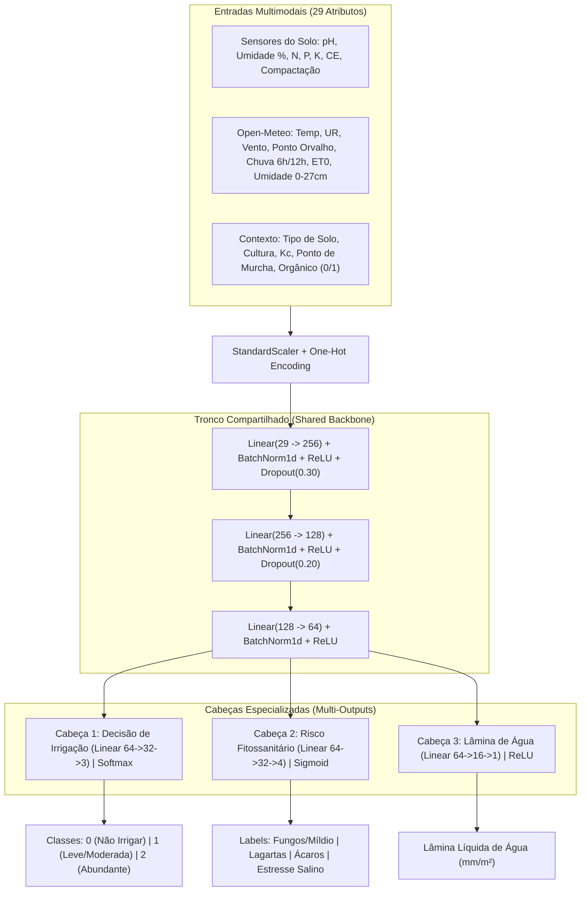

# 🌾 AgroMultitask AI: Sistema Inteligente de Decisão Agronômica & IoT

Sistema de **Deep Learning Multitarefa (Multitask Deep Learning)** desenvolvido em **PyTorch**, **Scikit-Learn** e **Pandas** para suporte avançado à tomada de decisões em **Agricultura de Precisão**.

O sistema realiza a fusão de dados físico-químicos do solo (sensores de campo / Arduino), parâmetros fisiológicos das culturas e variáveis agrometeorológicas em tempo real e de curto prazo via API **Open-Meteo**, inferindo simultaneamente **necessidade de irrigação**, **riscos fitossanitários** e **lâmina exata de água (mm/m²)**.

---

## 📌 Sumário
1. [Visão Geral do Projeto](#-visão-geral-do-projeto)
2. [Estrutura do Repositório](#-estrutura-do-repositório)
3. [Arquitetura da Rede Neural Multitarefa](#-arquitetura-da-rede-neural-multitarefa)
4. [Lógica Agronômica e Regras de Negócio](#-lógica-agronômica-e-regras-de-negócio)
5. [Resultados de Validação e Métricas](#-resultados-de-validação-e-métricas)
6. [Guia de Instalação e Execução](#-guia-de-instalação-e-execução)
7. [Exemplo de Uso em Código](#-exemplo-de-uso-em-código)
8. [Status Atual e Próximos Passos](#-status-atual-e-próximos-passos)

---

## 🚜 Visão Geral do Projeto

Diferente de abordagens tradicionais que utilizam modelos isolados para cada problema da lavoura, este sistema emprega uma **Rede Neural Multitarefa com Tronco Compartilhado (Shared Backbone)**. Isso permite que os padrões que explicam a retenção hídrica do solo também auxiliem na previsão de estresse osmótico e na suscetibilidade a patógenos.

### Principais Destaques:
- **Fusão Multissensorial**: Combina sensores físico-químicos (pH, umidade, NPK, condutividade e compactação) com previsões horárias de satélite/clima (6h e 12h).
- **Trava Física de Segurança**: Se houver previsão de chuva iminente (>5mm ou probabilidade >70%), a irrigação é sumariamente bloqueada para evitar asfixia radicular e desperdício de água e energia.
- **Diferenciação Legal de Manejo**: Recomendações de insumos estritamente segregadas entre **Cultivo Orgânico** (Lei Federal 10.831 / MAPA) e **Convencional** (Manejo Integrado de Pragas).
- **Alta Eficiência Computacional**: Processamento e enriquecimento de dados 100% vetorizado em NumPy (50.000 amostras processadas em ~0.27s).

---

## 📂 Estrutura do Repositório

```text
├── dados_solo_2casas.csv     # Dataset base de solo com 1.000.000 de registros físico-químicos
├── previsao_tempo.py         # Script protótipo original de consulta à API Open-Meteo
│
├── agronomy_rules.py        # Perfis de solo, culturas (Kc), balanço FAO-56 e catálogo de defensivos
├── weather_client.py        # Cliente Open-Meteo com cache local, retries e modo fallback resiliente
├── model_multitask.py       # Arquitetura PyTorch da Rede Multitarefa (AgroMultitaskNet)
├── data_engine.py           # Pipeline de amostragem, vetorização e normalização de features
├── train_pipeline.py        # Treinamento com split 80/10/10, otimizador AdamW e métricas
├── agro_system.py           # Motor de inferência, função predict_agro_system e relatório formatado
├── demo_run.py              # Script executável de homologação com 3 cenários reais de lavoura
│
├── best_agro_multitask.pth  # Checkpoint com os pesos neurais do melhor modelo treinado
├── agro_scaler_meta.pkl     # StandardScaler e metadados de features serializados
└── README.md                # Documentação técnica do projeto
```

---

## 🧠 Arquitetura da Rede Neural Multitarefa

A topologia da rede foi construída em **PyTorch** ([`model_multitask.py`](model_multitask.py)), estruturada com um tronco de extração de representações comuns e três ramificações independentes:



---

## 🔬 Lógica Agronômica e Regras de Negócio

As diretrizes técnicas foram codificadas em [`agronomy_rules.py`](agronomy_rules.py):

### 1. Ponderação da Decisão de Irrigação
1. **40% Déficit de Umidade Atual do Solo**:
   $$\text{Déficit} = \max(0, \text{Capacidade de Campo}_{\text{solo}} - \text{Umidade Atual})$$
2. **35% Balanço Hídrico Futuro (12 horas)**:
   $$\text{Balanço}_{12h} = \text{Chuva Prevista}_{12h} - ET_c \quad (\text{onde } ET_c = ET_0 \times K_c)$$
3. **25% Fator da Cultura ($K_c$) e Compactação Mecânica do Solo**.
4. **Trava Estrita de Tempestade**: Se $\text{Probabilidade de Chuva}_{6h} > 70\%$ ou $\text{Chuva}_{6h} \ge 5.0\text{ mm}$, o sistema suspende imediatamente a irrigação e zera o volume (`Classe = 0`, `Volume = 0.0 mm`).

### 2. Riscos Fitossanitários Mapeados
- **Fungos Foliares (Míldio / Requeima / Oídio)**: Umidade Relativa $\ge 78\%$ associada a temperaturas amenas entre $18^\circ\text{C}$ e $28.5^\circ\text{C}$.
- **Ácaros e Tripes**: Clima quente e seco ($\text{Temperatura} \ge 29.5^\circ\text{C}$ e $\text{UR} \le 45\%$).
- **Lagartas Mastigadoras**: Temperaturas de $22^\circ\text{C}$ a $32^\circ\text{C}$ com umidade moderada.
- **Estresse Hídrico / Salino**: Condutividade Elétrica $\ge 3.0\text{ dS/m}$ ou Umidade $\le \text{Ponto de Murcha}$ da cultura.

### 3. Matriz de Insumos (Orgânico vs Convencional)
- **Orgânico (`is_organico = True`)**: Calda Bordalesa (1%), Calda Sulfocálcica, *Trichoderma harzianum*, *Bacillus thuringiensis* (Bt), *Beauveria bassiana*, Óleo de Neem prensado a frio, Composto orgânico / Húmus de minhoca, Pó de rocha (remineralizador) e Fosfato Natural.
- **Convencional (`is_organico = False`)**: Triazóis + Estrobilurinas, Mancozeb, Diamidas antranílicas (Clorantraniliprole), Piretroides (Lambda-cialotrina), Abamectina, Nitrato de Cálcio, MAP solúvel e Ureia tratada com inibidor NBPT.

---

## 📊 Resultados de Validação e Métricas

Avaliação de generalização realizada no conjunto de **teste cego independente (5.000 amostras)**:

| Tarefa | Métrica | Valor Obtido | Impacto Prático |
| :--- | :--- | :--- | :--- |
| **Decisão de Irrigação** | **Acurácia Geral** | **97.82%** | Acerto quase perfeito entre não irrigar, irrigação leve e abundante. |
| | **Macro F1-Score** | **0.9785** | Equilíbrio perfeito entre as 3 classes sem viés para a classe majoritária. |
| **Risco Fitossanitário** | **Subset Accuracy** | **93.06%** | Em 93% dos casos acerta a combinação exata de todas as 4 pragas juntas. |
| | **Micro F1-Score** | **0.9732** | Altíssima precisão e revocação em nível de label. |
| | Risco Fungos | Acurácia: **98.48%** \| F1: **0.9456** | Detecção cirúrgica de molhamento foliar propício à esporulação. |
| | Risco Lagartas | Acurácia: **96.64%** \| F1: **0.9536** | Monitoramento preventivo de desfolhadoras. |
| | Risco Ácaros | Acurácia: **99.24%** \| F1: **0.8920** | Alerta assertivo sob aridez e calor. |
| | Estresse Salino | Acurácia: **98.60%** \| F1: **0.9910** | Detecção de impedimento osmótico e seca. |
| **Lâmina de Água (mm)** | **Erro Médio (MAE)** | **0.185 mm** | Erro de dosagem de água inferior a **0.2 mm/m²**. |
| | **RMSE** | **0.383 mm** | Baixíssima dispersão de erros extremos de rega. |

---

## 🚀 Guia de Instalação e Execução

### 1. Pré-requisitos
- Python 3.10 ou superior (testado e homologado no Python 3.14).
- Sistema Operacional: Windows / Linux / macOS.

### 2. Ativação do Ambiente Virtual
No Windows (PowerShell):
```powershell
.\.venv\Scripts\Activate.ps1
```

### 3. Execução da Demonstração e Homologação
Para rodar a demonstração com os três cenários agrícolas pré-configurados:
```powershell
.\.venv\Scripts\python.exe demo_run.py
```

### 4. Retreinar o Modelo (Opcional)
Para reprocessar o dataset e treinar novamente a rede do zero por 15 épocas:
```powershell
.\.venv\Scripts\python.exe train_pipeline.py
```

---

## 💻 Exemplo de Uso em Código

Como importar e consumir a inteligência preditiva em qualquer script ou backend:

```python
from agro_system import predict_agro_system, formatar_relatorio_terminal

# 1. Simulação dos dados recebidos do campo (Arduino / Sensores IoT)
dados_arduino = {
    "tipo_solo": "arenoso",
    "pH": 6.10,
    "teor_umildade_%": 1.40,
    "nitrogenio_N_ppm": 2.10,
    "fosforo_P_ppm": 1.90,
    "potassio_K_ppm": 1.80,
    "condutividade_eletrica_dS/m": 0.85,
    "compactacao_solo_kPa": 1450.0
}

# 2. Chamada da predição inteligente (consulta clima no Open-Meteo automaticamente)
relatorio = predict_agro_system(
    lat=-21.55,
    lon=-46.88,
    cultura="cafe",
    is_organico=False,
    dados_arduino_dict=dados_arduino
)

# 3. Exibir o relatório agronômico estruturado no console
print(formatar_relatorio_terminal(relatorio))

# 4. Acessar os campos diretamente em formato JSON / Dicionário
print(f"Decisão: {relatorio['decisao_irrigacao']['status']}")
print(f"Lâmina: {relatorio['decisao_irrigacao']['volume_agua_recomendado_mm']} mm")
print(f"Ações Recomendadas: {relatorio['plano_de_acao_prescritivo']['acoes_e_insumos_recomendados']}")
```

---

## 🗺️ Status Atual e Próximos Passos

| Etapa | Descrição | Status |
| :--- | :--- | :---: |
| **Engenharia Agronômica** | Fórmulas FAO-56, balanço hídrico, travas meteorológicas e catálogo de insumos | Concluído |
| **Pipeline de Dados** | Leitura de solos, síntese de cenários climáticos e vetorização NumPy | Concluído |
| **Modelagem Multitarefa** | Rede PyTorch `AgroMultitaskNet` com 3 cabeças e otimizador AdamW | Concluído |
| **Validação & Teste** | Avaliação cega (97.8% acurácia irrigação, 93% pragas, 0.18mm MAE) | Concluído |
| **Persistência em Banco** | Criação do banco de dados (SQLite/PostgreSQL) para salvar histórico das leituras | **Próximo Passo** |
| **Bot do Telegram** | Envio de alertas de pragas e relatórios de irrigação direto no celular | **Próximo Passo** |
| **Integração Física** | Leitura contínua da Serial USB / Wi-Fi do Arduino e acionamento de relés | Futuro |
