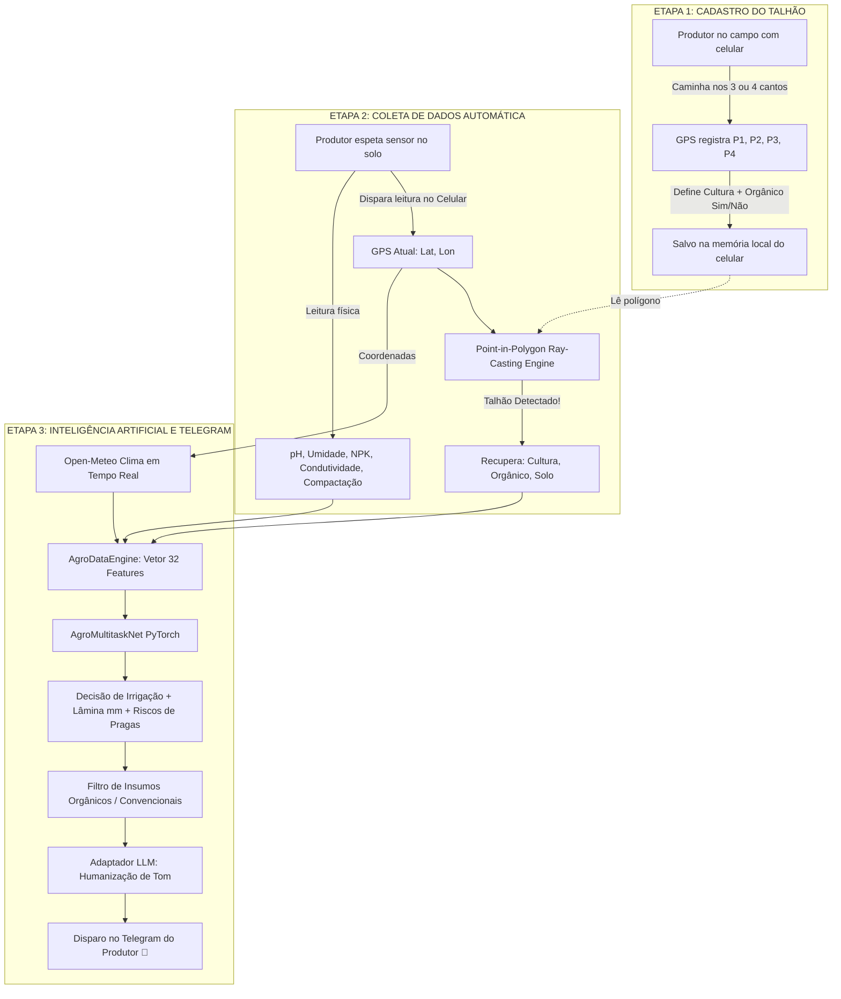

# 🌾 AgroAlerta: Plataforma Agronômica Inteligente, IoT & Decisão por Deep Learning

Sistema completo de suporte à decisão para **Agricultura de Precisão** e **Manejo Agroecológico/Convencional**, unindo **Deep Learning Multitarefa (PyTorch)**, **Georreferenciamento de Talhões via GPS**, **Operação Offline-First no Celular** e **Assistente Conversacional no Telegram com IA Generativa (LLM)**.

O sistema atende com precisão a produtores do interior paulista (calibrado para **Rio Claro - SP** e microrregião), combinando leituras físico-químicas de sensores de solo, previsão climática em tempo real via **Open-Meteo**, zoneamento agroclimático (**ZARC**) e sazonalidade de preços do **CEAGESP**.

---

## 📌 Sumário
1. [Principais Inovações e Funcionalidades](#-principais-inovações-e-funcionalidades)
2. [Fluxo Operacional de Campo](#-fluxo-operacional-de-campo)
3. [Arquitetura da Rede Neural Multitarefa](#-arquitetura-da-rede-neural-multitarefa)
4. [Diferenciação para Produtores Orgânicos](#-diferenciação-para-produtores-orgânicos)
5. [Adaptação Regional para Rio Claro - SP](#-adaptação-regional-para-rio-claro---sp)
6. [Assistente no Telegram com LLM](#-assistente-no-telegram-com-llm)
7. [Estrutura do Repositório](#-estrutura-do-repositório)
8. [Resultados e Métricas de Validação](#-resultados-e-métricas-de-validação)
9. [Guia de Instalação e Execução](#-guia-de-instalação-e-execução)

---

## 🚀 Principais Inovações e Funcionalidades

### 1. Delimitação de Talhões Georreferenciados (3 ou 4 Vértices)
- O produtor caminha até as extremidades da sua área de plantio com o smartphone e marca os vértices no GPS:
  - **Triângulos (3 pontos)** ou **Quadriláteros/Retângulos (4 pontos)**;
- Associa o nome da área, a cultura plantada e se o regime é **Orgânico Certificado** ou **Convencional**.

### 2. Identificação Automática na Coleta (Point-in-Polygon)
- Ao espetar o sensor no solo e clicar em *"Identificar Talhão"*, o aplicativo captura a coordenada GPS atual `(lat, lon)` e executa o algoritmo **Ray-Casting** com tolerância de amortecimento para oscilações de sinal de celular (~8 metros);
- O sistema detecta automaticamente o talhão correspondente e resgata todo o histórico de manejo **sem necessidade de digitação manual**.

### 3. Arquitetura Offline-First no Celular
- **Gravação Local em JSON:** Todas as marcações de talhões e leituras de sensores são armazenadas no navegador móvel (`localStorage`);
- **Fila de Sincronização Resiliente:** Se o produtor estiver em um ponto da lavoura sem cobertura 3G/4G, os dados continuam acumulados com segurança;
- **Sincronização e Limpeza Automática:** Assim que o dispositivo detecta sinal de internet (`online`), ele sincroniza em lote com o banco de dados e **esvazia/limpa a fila local**.

### 4. Assistente de Campo no Telegram com Tom Humanizado (LLM)
- Cada nova leitura analisada gera um boletim claro no Telegram do produtor;
- Integração com **Google Gemini** e gerador nativo com tom empático de homem do campo:
  - Responde perguntas livres do produtor (*"Preciso regar meu milho hoje?"*, *"O que devo plantar agora em outubro?"*);
  - Traduz dados técnicos frios em orientações práticas com emojis e linguagem clara.

### 5. Motor de Recomendação de Culturas e Sazonalidade (ZARC + CEAGESP)
- Avalia o solo da gleba, o calendário agroclimático de Rio Claro - SP e as cotações históricas do CEAGESP;
- Prescreve: **O que plantar**, **Como plantar** (espaçamento, profundidade e adubação orgânica/mineral) e **Qual o melhor período**.

---

## 🔄 Fluxo Operacional de Campo



---

## 🧠 Arquitetura da Rede Neural Multitarefa

Construída em **PyTorch** ([`Rede Neural/model_multitask.py`](Rede%20Neural/model_multitask.py)), utiliza a abordagem de **Hard Parameter Sharing (Tronco Compartilhado)** com **~55.944 parâmetros treináveis**:

* **Entrada (32 Features):** 23 variáveis numéricas contínuas padronizadas via `StandardScaler` + One-Hot Encoding de tipos de solo (incluindo *Latossolo Vermelho*) + One-Hot de culturas (incluindo *Citros* e *Cana*) + flag binária `is_organico`.
* **Tronco Compartilhado (Backbone):**
  - Bloco 1: `Linear(32 -> 256)` + `BatchNorm1d(256)` + `ReLU` + `Dropout(0.30)`
  - Bloco 2: `Linear(256 -> 128)` + `BatchNorm1d(128)` + `ReLU` + `Dropout(0.20)`
  - Bloco 3: `Linear(128 -> 64)` + `BatchNorm1d(64)` + `ReLU`
* **Cabeças Especializadas (Task-Specific Heads):**
  - **Cabeça 1 (Irrigação):** `Linear(64 -> 32 -> 3)` com Softmax (Classes: 0: Não Irrigar, 1: Leve/Moderada, 2: Abundante).
  - **Cabeça 2 (Fitossanidade):** `Linear(64 -> 32 -> 4)` com Sigmoid (Multilabel: Fungos, Insetos, Ácaros, Estresse Salino/Hídrico).
  - **Cabeça 3 (Volume de Água):** `Linear(64 -> 16 -> 1)` com ReLU (Regressão contínua da lâmina líquida em mm).

---

## 🌿 Diferenciação para Produtores Orgânicos

1. **Balanço Hídrico Real:** O modelo incorpora a redução de **$25\%$ na evapotranspiração** promovida pela cobertura morta (*mulching*) e o aumento de **$15\%$ na faixa de retenção de umidade** conferido pela matéria orgânica estabilizada.
2. **Catálogo Estrito de Insumos:**
   - **Orgânico:** Calda Bordalesa, Calda Sulfocálcica, *Bacillus thuringiensis*, *Beauveria bassiana*, Sabão Potássico, Óleo de Neem, Pó de Rocha (Remineralizadores) e Esterco Curtido / Torta de Mamona (em conformidade com a Lei Federal 10.831 / MAPA).
   - **Convencional:** Fungicidas sistêmicos (Triazóis + Estrobilurinas), Inseticidas (Diamidas, Piretroides) e Fertilizantes Solúveis (Nitrato de Cálcio, MAP, KCl).

---

## 📍 Adaptação Regional para Rio Claro - SP

- **Culturas Nativas da Região:** Suporte completo para **Citros (Laranja/Tangerina/Limão)** e **Cana-de-açúcar**, além de Tomate, Alface e Milho.
- **Tipos de Solo Locais:** Calibrado para os **Latossolos Vermelhos** e Argissolos típicos da Formação Corumbataí e Formação Rio Claro.
- **Microclima Cwa / Aw:** Trava meteorológica de segurança integrada às chuvas convectivas de verão e estiagem severa de inverno do interior paulista.

---

## 💬 Assistente no Telegram com LLM

O bot do Telegram ([`backend/bot.py`](backend/bot.py)) aproxima a tecnologia do dia a dia do homem do campo:
- **Comando `/start`**: Apresenta os comandos e exibe o ID de conexão.
- **Comando `/irrigar`**: Resumo rápido sobre necessidade de ligar os motores de rega hoje.
- **Comando `/plantar`**: Sugestões agronômicas do mês para Rio Claro com previsão de colheita e preços.
- **Comando `/talhoes`**: Lista todas as áreas mapeadas na propriedade.
- **Perguntas Livres**: O produtor pode enviar mensagens como *"Tem risco de bicho no meu tomate?"* ou *"Qual adubo orgânico coloco no milho?"*, e o LLM responde com linguagem prática baseada nos dados salvos do talhão.

---

## 📂 Estrutura do Repositório

```text
├── README.md                      # Documentação técnica completa
├── test_integration_complete.py   # Bateria de testes de integração automatizados
│
├── backend/                       # Serviços de Backend e Telegram
│   ├── bot.py                     # Bot interativo do Telegram com handlers
│   ├── llm_adapter.py             # Integração com Gemini API e tom humanizado
│   ├── geo_engine.py              # Algoritmo Ray-Casting Point-in-Polygon
│   ├── db_manager.py              # Persistência híbrida (Supabase / SQLite local)
│   ├── server.py                  # API REST Flask para sincronização offline
│   └── config.exemplo.py          # Modelo de configuração para tokens e chaves
│
├── frontend/                      # Web App Mobile Offline-First
│   ├── index.html                 # Interface com abas de Coleta, Marcação e Safra
│   └── mock_esp32.py              # Emulador local de leituras de sensores IoT
│
├── Rede Neural/                   # Módulos de Deep Learning e Agronomia
│   ├── agronomy_rules.py          # Perfis de solo, culturas, FAO-56 e bioinsumos
│   ├── data_engine.py             # Vetorização e processamento 100% NumPy
│   ├── model_multitask.py         # Arquitetura da AgroMultitaskNet em PyTorch
│   ├── train_pipeline.py          # Treinamento com AdamW e avaliação multitarefa
│   ├── agro_system.py             # Motor de predição e formulação de relatórios
│   ├── crop_recommendation.py     # Motor ZARC / Sazonalidade CEAGESP
│   ├── weather_client.py          # Cliente Open-Meteo com cache e retries
│   ├── best_agro_multitask.pth    # Pesos treinados do modelo
│   ├── agro_scaler_meta.pkl       # Metadados e StandardScaler serializados
│   └── dados_solo_2casas.csv      # Dataset base físico-químico do solo
```

---

## 📊 Resultados e Métricas de Validação

Avaliação realizada em conjunto de teste cego ($5.000$ amostras independentes):

| Tarefa Avaliada | Métrica Principal | Resultado Obtido |
| :--- | :--- | :--- |
| **Decisão de Irrigação (3 Classes)** | Acurácia Geral | **97,22%** |
| | Macro F1-Score | **0,9727** |
| **Fitossanidade (4 Labels Multilabel)** | Subset Accuracy (Exata) | **92,36%** |
| | Micro F1-Score | **0,9692** |
| | Acurácia - Fungos / Míldio | **98,20%** |
| | Acurácia - Ácaros e Tripes | **99,22%** |
| **Lâmina de Água Necessária** | Erro Médio Absoluto (MAE) | **0,228 mm** |
| | Raiz do Erro Quadrático (RMSE)| **0,488 mm** |

---

## 🛠️ Guia de Instalação e Execução

### 1. Pré-requisitos
- Python 3.10 ou superior;
- Instalar dependências:
  ```bash
  pip install torch torchvision pandas scikit-learn requests python-telegram-bot flask flask-cors
  ```

### 2. Configurar Credenciais
Copie o arquivo de exemplo e insira seu token do Telegram e chave do Gemini:
```bash
cp backend/config.exemplo.py backend/config.py
```

### 3. Executar os Testes de Integração
Valide todos os módulos de ponta a ponta:
```bash
python test_integration_complete.py
```

### 4. Iniciar o Servidor API e a Interface Mobile
```bash
# Terminal 1: Iniciar servidor REST
python backend/server.py

# Terminal 2: Iniciar o Bot do Telegram
python backend/bot.py --poll
```
Abra `frontend/index.html` no navegador do celular ou computador para delimitar seus talhões e realizar coletas de solo!
