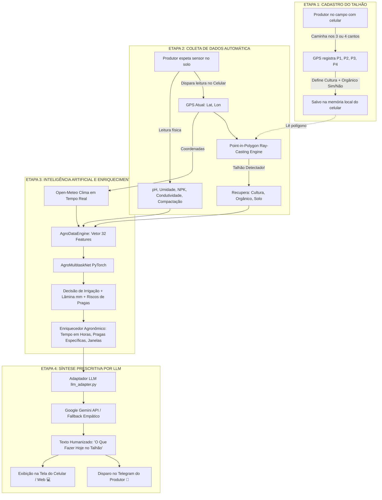

# 🌾 AgroAlerta: Plataforma Agronômica Inteligente, IoT & Decisão por Deep Learning

Sistema completo de suporte à decisão para **Agricultura de Precisão** e **Manejo Agroecológico/Convencional**, unindo **Deep Learning Multitarefa (PyTorch)**, **Georreferenciamento de Talhões via GPS**, **Operação Offline-First no Celular** e **Síntese Prescritiva no Telegram com IA Generativa (LLM)**.

O sistema atende com precisão a produtores do interior paulista (calibrado para **Rio Claro - SP** e microrregião), combinando leituras físico-químicas de sensores de solo, previsão climática em tempo real via **Open-Meteo**, zoneamento agroclimático (**ZARC**) e sazonalidade de preços do **CEAGESP**.

---

## 📌 Sumário
1. [Principais Inovações e Funcionalidades](#-principais-inovações-e-funcionalidades)
2. [Fluxo Operacional de Campo](#-fluxo-operacional-de-campo)
3. [Saída Enriquecida & Síntese Prescritiva por LLM](#-saída-enriquecida--síntese-prescritiva-por-llm)
4. [Arquitetura da Rede Neural Multitarefa](#-arquitetura-da-rede-neural-multitarefa)
5. [Diferenciação para Produtores Orgânicos](#-diferenciação-para-produtores-orgânicos)
6. [Adaptação Regional para Rio Claro - SP](#-adaptação-regional-para-rio-claro---sp)
7. [Assistente no Telegram com LLM](#-assistente-no-telegram-com-llm)
8. [Estrutura do Repositório](#-estrutura-do-repositório)
9. [Resultados e Métricas de Validação](#-resultados-e-métricas-de-validação)
10. [Guia de Instalação e Execução](#-guia-de-instalação-e-execução)

---

## 🚀 Principais Inovações e Funcionalidades

### 1. Delimitação de Talhões Georreferenciados (3 ou 4 Vértices)
- O produtor caminha até as extremidades da sua área de plantio com o smartphone e marca os vértices no GPS:
  - **Triângulos (3 pontos)** ou **Quadriláteros/Retângulos (4 pontos)**;
- Associa o nome da área, a cultura plantada e se o regime é **Orgânico Certificado** ou **Convencional**.

### 2. Identificação Automática na Coleta (Point-in-Polygon)
- Ao espetar o sensor no solo e clicar em *"Identificar Talhão"*, o aplicativo captura a coordenada GPS atual `(lat, lon)` e executa o algoritmo **Ray-Casting** com tolerância de amortecimento para oscilações de sinal de celular (~8 metros);
- O sistema detecta automaticamente o talhão correspondente e resgata todo o histórico de manejo **sem necessidade de digitação manual**.

### 3. Arquitetura Offline-First no Celular
- **Gravação Local em JSON:** Todas as marcações de talhões e leituras de sensores são armazenadas no navegador móvel (`localStorage`);
- **Fila de Sincronização Resiliente:** Se o produtor estiver em um ponto da lavoura sem cobertura 3G/4G, os dados continuam acumulados com segurança;
- **Sincronização e Limpeza Automática:** Assim que o dispositivo detecta sinal de internet (`online`), ele sincroniza em lote com o banco de dados e **esvazia/limpa a fila local**.

### 4. Cálculo da Área Total do Talhão e Dimensionamento em Litros
- A partir dos 3 ou 4 vértices georreferenciados, o sistema calcula a **área real do talhão em hectares** através da fórmula de Gauss (Shoelace);
- O motor agronômico dimensiona com precisão matemática a **litragem total necessária para irrigar toda a área** ($V = \text{Lâmina (mm)} \times 10.000 \times \text{área (ha)}$) e a **economia real de água poupada** em litros quando a rega é suspensa (por chuva iminente ou umidade adequada no solo).

### 5. Separação Estrita de Arquitetura: Rede Neural (Dados Limpos) vs LLM (Texto Prescritivo)
- **Rede Neural Multitarefa & Motor Analítico:** Responsáveis por uma **saída simples, limpa e enxuta (JSON estruturado)** contendo apenas métricas numéricas puras, classes, probabilidades de irrigação e pragas, tempos operacionais de bomba e dimensionamento hídrico por hectare. Não gera textos dissertativos longos estáticos.
- **Camada de LLM (Google Gemini / Fallback Empático):** Responsável exclusivo por **gerar a resposta em texto corrido, humanizado e explicativo** para o produtor rural, traduzindo as variáveis técnicas em uma conversa direta sobre o que fazer no campo, o total de litros envolvidos e orientações práticas de manejo.

---

## 🔄 Fluxo Operacional de Campo


```mermaid
flowchart TD
    subgraph ETAPA 1: CADASTRO DO TALHÃO
        A[Produtor no campo com celular] -->|Caminha nos 3 ou 4 cantos| B[GPS registra P1, P2, P3, P4]
        B -->|Define Cultura + Orgânico Sim/Não| C[Salvo na memória local do celular]
    end

    subgraph ETAPA 2: COLETA DE DADOS AUTOMÁTICA
        D[Produtor espeta sensor no solo] -->|Dispara leitura no Celular| E[GPS Atual: Lat, Lon]
        E --> F[Point-in-Polygon Ray-Casting Engine]
        C -.->|Lê polígono| F
        F -->|Talhão Detectado!| G[Recupera: Cultura, Orgânico, Solo]
        D -->|Leitura física| H[pH, Umidade, NPK, Condutividade, Compactação]
    end

    subgraph ETAPA 3: INTELIGÊNCIA ARTIFICIAL E ENRIQUECIMENTO
        E -->|Coordenadas| I[Open-Meteo Clima em Tempo Real]
        G --> J[AgroDataEngine: Vetor 32 Features]
        H --> J
        I --> J
        J --> K[AgroMultitaskNet PyTorch]
        K --> L[Decisão de Irrigação + Lâmina mm + Riscos de Pragas]
        L --> M[Enriquecedor Agronômico: Tempo em Horas, Pragas Específicas, Janelas]
    end

    subgraph ETAPA 4: SÍNTESE PRESCRITIVA POR LLM
        M --> N[Adaptador LLM llm_adapter.py]
        N --> O[Google Gemini API / Fallback Empático]
        O --> P["Texto Humanizado: 'O Que Fazer Hoje no Talhão'"]
        P --> Q[Disparo no Telegram do Produtor 📱]
        P --> R[Exibição na Tela do Celular / Web 💻]
    end
```

---

## 📋 Saída Simples da Rede Neural & Síntese Prescritiva por LLM

A arquitetura adota a **separação estrita de responsabilidades**:
1. A **Rede Neural** gera uma estrutura de dados simples, limpa e enxuta (JSON com métricas físicas, probabilidades e dimensionamento por hectare);
2. O **LLM** consome esses dados numéricos e redige a orientação acolhedora, explicativa e humanizada para o produtor rural.

### 1. Saída Simples da Rede Neural (JSON Analítico Enxuto):
```json
{
  "talhao": {
    "area_ha": 4.5,
    "cultura": "citros",
    "regime": "Cultivo Orgânico Certificado"
  },
  "decisao_irrigacao": {
    "classe_codigo": 1,
    "status": "Irrigar Leve/Moderada (Reposição de Déficit)",
    "lamina_mm": 2.31
  },
  "metricas_hidricas_area": {
    "volume_necessario_litros": 103950.0,
    "tempo_gotejamento_minutos": 50,
    "tempo_aspersao_minutos": 21,
    "litros_por_planta": 51.3
  },
  "riscos_fitossanitarios": [
    {
      "alerta": "Risco de Insetos e Lagartas Mastigadoras",
      "prob_pct": 46.8,
      "nivel": "Moderado"
    }
  ]
}
```

### 2. Resposta em Texto Gerada pelo LLM para o Celular / Telegram:
```text
👨‍🌾 Prescrição do Campo — AgroAlerta
📍 Talhão de Citros (~4.50 ha) | Cultivo Orgânico Certificado 🌱

🚀 1. O QUE FAZER NA IRRIGAÇÃO AGORA:
• LIGAR IRRIGAÇÃO: Aplicar lâmina de 2.3 mm de reposição hídrica.
  💧 Volume Total da Área: ~103,950 litros de água para os 4.50 hectares.
  ⏱️ Tempo de Gotejamento: 0h 50min
  ⏱️ Tempo de Aspersão: 0h 21min
  🥤 Dose: ~51.3 litros por planta.
  ⏰ Melhor Horário: Início da manhã (06:00 às 08:00) ou fim da tarde (17:30 às 19:30). Evitar meio-dia.

🔍 2. O QUE VISTORIAR NO SEU CITROS:
• Alerta de Insetos e Lagartas Mastigadoras (Risco Moderado - 46.8%):
  ⚠️ Psilídeo (Diaphorina citri) - VETOR DO GREENING/HLB: Olhar nas folhas para ver se há: Insetos jovens nos brotos novos; transmissão irreversível da pior doença citrícola.
  ⚠️ Bicho-Furão (Gymnandrosoma aurantianum): Olhar nas folhas para ver se há: Lagartas perfurando a polpa do fruto causando queda prematura.

🌿 3. RECEITA E MANEJO PRÁTICO (ORGÂNICO):
⏰ Janela de Aplicação: Final da tarde (a partir das 16:30) ou dias nublados. Raios solares fortes degradam bioinsumos (Bt e Beauveria).
• Aplicação de inseticida biológico à base de Bacillus thuringiensis (Bt) - estirpes kurstaki
• Pulverização de Óleo de Neem 100% puro prensado a frio (0.5% a 1.0% de calda)
• Instalação de armadilhas luminosas e feromônios específicos de captura

💡 Por que tomamos essa decisão: O déficit hídrico calculado para a área de 4.50 ha é de 2.3 mm, considerando a demanda evaporativa do ar de 5.2 mm e a fase fenológica da planta.
```

---

## 🧠 Arquitetura da Rede Neural Multitarefa

Construída em **PyTorch** ([`Rede Neural/model_multitask.py`](Rede%20Neural/model_multitask.py)), utiliza a abordagem de **Hard Parameter Sharing (Tronco Compartilhado)** com **~55.944 parâmetros treináveis**:

* **Entrada (32 Features):** 23 variáveis numéricas contínuas padronizadas via `StandardScaler` + One-Hot Encoding de solos (incluindo *Latossolo Vermelho*) + One-Hot de culturas (incluindo *Citros* e *Cana*) + flag binária `is_organico`.
* **Tronco Compartilhado (Backbone):**
  - Bloco 1: `Linear(32 -> 256)` + `BatchNorm1d(256)` + `ReLU` + `Dropout(0.30)`
  - Bloco 2: `Linear(256 -> 128)` + `BatchNorm1d(128)` + `ReLU` + `Dropout(0.20)`
  - Bloco 3: `Linear(128 -> 64)` + `BatchNorm1d(64)` + `ReLU`
* **Cabeças Especializadas (Task-Specific Heads):**
  - **Cabeça 1 (Irrigação):** `Linear(64 -> 32 -> 3)` com Softmax (Classes: 0: Não Irrigar, 1: Leve/Moderada, 2: Abundante).
  - **Cabeça 2 (Fitossanidade):** `Linear(64 -> 32 -> 4)` com Sigmoid (Multilabel: Fungos, Insetos, Ácaros, Estresse Salino/Hídrico).
  - **Cabeça 3 (Volume de Água):** `Linear(64 -> 16 -> 1)` com ReLU (Regressão contínua da lâmina líquida em mm).

---

## 🌿 Diferenciação para Produtores Orgânicos

1. **Balanço Hídrico Real:** O modelo incorpora a redução de **$25\%$ na evapotranspiração** promovida pela cobertura morta (*mulching*) e o aumento de **$15\%$ na faixa de retenção de umidade** conferido pela matéria orgânica estabilizada.
2. **Catálogo Estrito de Insumos:**
   - **Orgânico:** Calda Bordalesa, Calda Sulfocálcica, *Bacillus thuringiensis*, *Beauveria bassiana*, Sabão Potássico, Óleo de Neem, Pó de Rocha (Remineralizadores) e Esterco Curtido / Torta de Mamona (em conformidade com a Lei Federal 10.831 / MAPA).
   - **Convencional:** Fungicidas sistêmicos (Triazóis + Estrobilurinas), Inseticidas (Diamidas, Piretroides) e Fertilizantes Solúveis (Nitrato de Cálcio, MAP, KCl).

---

## 📍 Adaptação Regional para Rio Claro - SP

- **Culturas Nativas da Região:** Suporte completo para **Citros (Laranja/Tangerina/Limão)** e **Cana-de-açúcar**, além de Tomate, Alface e Milho.
- **Tipos de Solo Locais:** Calibrado para os **Latossolos Vermelhos** e Argissolos típicos da Formação Corumbataí e Formação Rio Claro.
- **Microclima Cwa / Aw:** Trava meteorológica de segurança integrada às chuvas convectivas de verão e estiagem severa de inverno do interior paulista.

---

## 💬 Assistente no Telegram com LLM

O bot do Telegram ([`backend/bot.py`](backend/bot.py)) aproxima a tecnologia do dia a dia do homem do campo:
- **Comando `/start`**: Apresenta os comandos e exibe o ID de conexão.
- **Comando `/irrigar`**: Resumo rápido sobre necessidade de ligar os motores de rega hoje.
- **Comando `/plantar`**: Sugestões agronômicas do mês para Rio Claro com previsão de colheita e preços.
- **Comando `/talhoes`**: Lista todas as áreas mapeadas na propriedade.
- **Perguntas Livres**: O produtor pode enviar mensagens como *"Tem risco de bicho no meu tomate?"* ou *"Qual adubo orgânico coloco no milho?"*, e o LLM responde com linguagem prática baseada nos dados salvos do talhão.

---

## 📂 Estrutura do Repositório

```text
├── README.md                      # Documentação técnica completa
├── requirements.txt               # Dependências do projeto para pip
├── test_integration_complete.py   # Bateria de 6 testes de integração automatizados
│
├── backend/                       # Serviços de Backend e Telegram
│   ├── bot.py                     # Bot interativo do Telegram com handlers
│   ├── llm_adapter.py             # Síntese prescritiva via Gemini API e fallback empático
│   ├── geo_engine.py              # Algoritmo Ray-Casting Point-in-Polygon e cálculo Shoelace
│   ├── db_manager.py              # Persistência híbrida (Supabase / SQLite local)
│   ├── server.py                  # API REST Flask com resposta de prescrição LLM
│   └── config.exemplo.py          # Modelo de configuração para tokens e chaves
│
├── frontend/                      # Web App Mobile Offline-First
│   ├── index.html                 # Interface com Coleta, Marcação e Prescrição LLM
│   └── mock_esp32.py              # Emulador local de leituras de sensores IoT
│
├── Rede Neural/                   # Módulos de Deep Learning e Agronomia
│   ├── agronomy_rules.py          # Perfis de solo, culturas, pragas específicas e FAO-56
│   ├── data_engine.py             # Vetorização e processamento 100% NumPy
│   ├── model_multitask.py         # Arquitetura da AgroMultitaskNet em PyTorch
│   ├── train_pipeline.py          # Treinamento com AdamW e avaliação multitarefa
│   ├── agro_system.py             # Motor de predição e formulação da saída analítica simples
│   ├── demo_run.py                # Script de demonstração dos cenários e síntese por LLM
│   ├── crop_recommendation.py     # Motor ZARC / Sazonalidade CEAGESP
│   ├── weather_client.py          # Cliente Open-Meteo com cache e retries
│   ├── best_agro_multitask.pth    # Pesos treinados do modelo
│   ├── agro_scaler_meta.pkl       # Metadados e StandardScaler serializados
│   └── dados_solo_2casas.csv      # Dataset base físico-químico do solo
```

---

## 📊 Resultados e Métricas de Validação

Avaliação realizada em conjunto de teste cego ($5.000$ amostras independentes):

| Tarefa Avaliada | Métrica Principal | Resultado Obtido |
| :--- | :--- | :--- |
| **Decisão de Irrigação (3 Classes)** | Acurácia Geral | **97,22%** |
| | Macro F1-Score | **0,9727** |
| **Fitossanidade (4 Labels Multilabel)** | Subset Accuracy (Exata) | **92,36%** |
| | Micro F1-Score | **0,9692** |
| | Acurácia - Fungos / Míldio | **98,20%** |
| | Acurácia - Ácaros e Tripes | **99,22%** |
| **Lâmina de Água Necessária** | Erro Médio Absoluto (MAE) | **0,228 mm** |
| | Raiz do Erro Quadrático (RMSE)| **0,488 mm** |

---

## 🛠️ Guia de Instalação e Execução

### 1. Instalar Dependências
```bash
pip install -r requirements.txt
```

### 2. Configurar Credenciais
Copie o arquivo de exemplo e insira seu token do Telegram e chave do Gemini (se desejar usar a API do Google; caso contrário, o sistema utilizará o gerador local embutido):
```bash
cp backend/config.exemplo.py backend/config.py
```

### 3. Executar Demonstração Completa do Sistema
Veja a Rede Neural e o LLM operando em 3 cenários práticos (Citros em 4.5 ha com reposição em litros, Tomate em 2.3 ha com trava de chuva e economia de água, e Planejamento de Safra ZARC):
```bash
python "Rede Neural/demo_run.py"
```

### 4. Executar os Testes de Integração
Valide todos os 6 módulos de ponta a ponta:
```bash
python test_integration_complete.py
```

### 5. Iniciar o Servidor API e o Bot do Telegram
```bash
# Terminal 1: Iniciar servidor REST
python backend/server.py

# Terminal 2: Iniciar o Bot do Telegram
python backend/bot.py --poll
```
Abra `frontend/index.html` no navegador do celular ou computador para delimitar seus talhões, realizar coletas de solo e receber a prescrição imediata da IA!
